# Практическая работа по предмету "Управление данными"

## Содержание

- [Работа с Yandex-cloud](#работа-с-yandex-cloud)
  - [Создание БД](#создание-бд)
  - [Работа с БД](#работа-с-бд)
- [Работа с Функциями](#работа-с-функциями)
  - [Подключение БД к функциям](#подключение-бд-к-функциям)
    - [Набор зависимостей проекта - requirements.txt](#набор-зависимостей-проекта---requirementstxt)
    - [Набор используемых исключений - exception.py](#набор-используемых-исключений---exceptionpy)
    - [Класс-хранилище переменных среды - config.py](#класс-хранилище-переменных-среды---configpy)
    - [Класс для работы с подключением - dbclient.py](#класс-для-работы-с-подключением---dbclientpy)
    - [Класс для работы с БД - cars_reader.py](#класс-для-работы-с-бд---cars_readerpy)
    - [Методы для перевода объектов в JSON - serialize.py](#методы-для-перевода-объектов-в-json---serializepy)
    - [Точка входа - index.py](#точка-входа---indexpy)
  - [Тестирование](#тестирование)

## Работа с Yandex-cloud

Яндекс является провайдером, предоставляющим программистам сервисы для облачных вычислений.
В данном случае, мы будем пользоваться двумя: `YDB (Yandex data base)` и `Cloud Functions`:

Для начала работы, необходимо перейти в [консоль](https://console.cloud.yandex.ru).
Зайти или зарегестрироваться, можно через гугл или вк. В боковой панели
выбрать "все сервисы", найти приведённые на рисунке и закрепить:

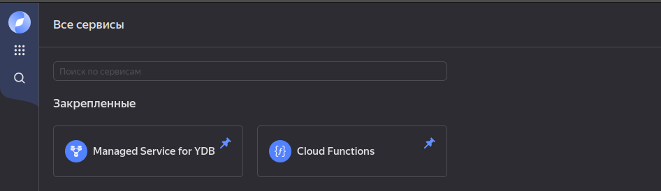

### Создание БД

Для создания вашей базы данных, нужно перейти в раздел `Managed Service for YDB`.
Вы увидите перед собой окно с предложением создать базу:

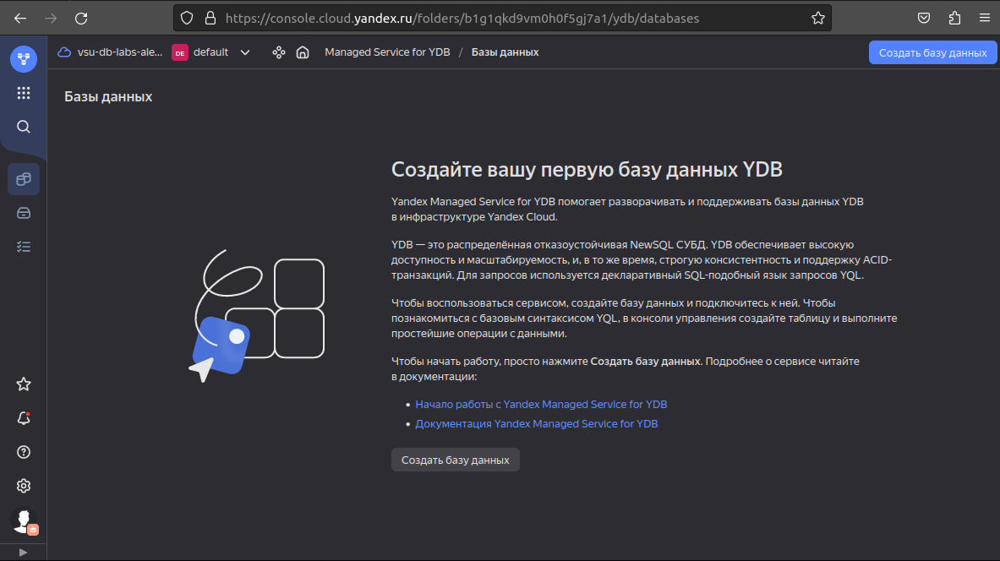

При создании появялется форма, в которой нужно указать имя вашей базы и **не
менять** остальные параметры.

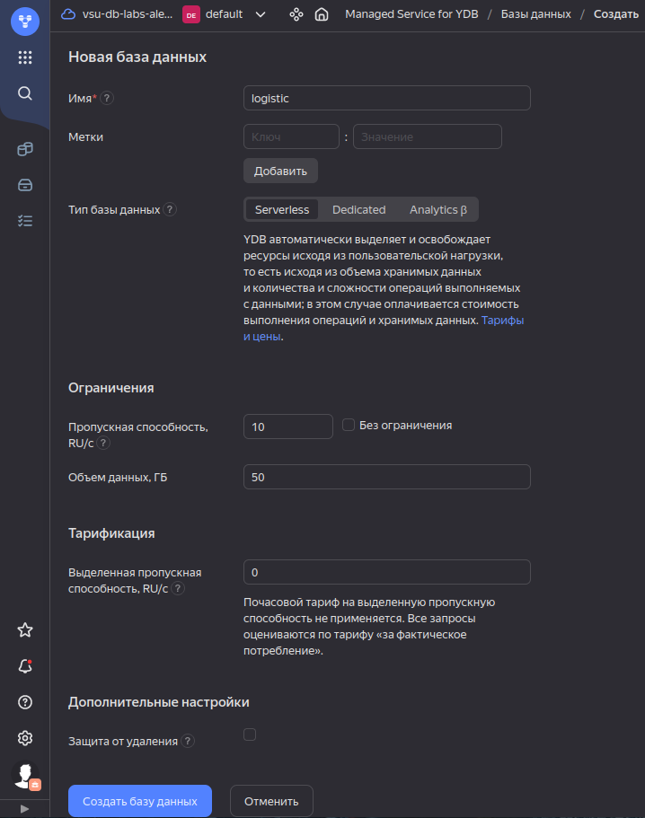

Нужно привязать систему к платёжному аккаунту. Первые небольшие объемы данных
предоставляются бесплатно, так что не придётся ничего платить, если
не подключать какие-либо дополнительные услуги ([Подробнее о тарифах](https://cloud.yandex.ru/docs/ydb/pricing/serverless#prices)).

Процесс привязки состоит в создании платёжного аккаунта с картой. 
Для подтверждения Яндекс спишет и вернёт на карту 11 рублей.

После привязки вы можете перейти на главную страницу сервиса, в которой будет
отображаться строка с вашей базой и статусом `Running`. При клике на неё открывается
окно управления с описанием, статусом и дополнительными разделами:

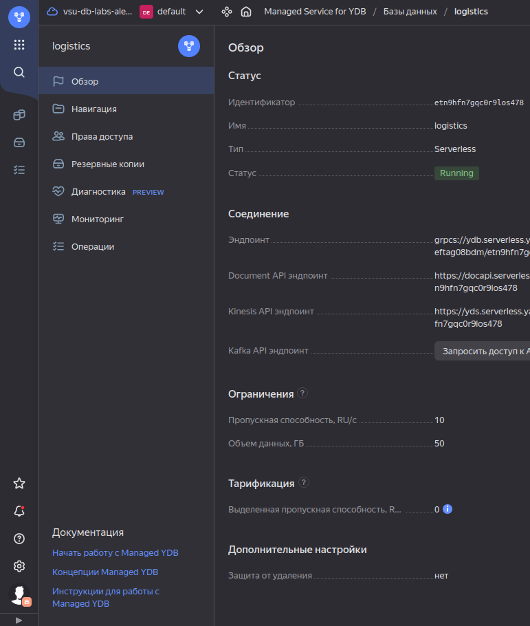

### Работа с БД

В разделе `Навигация` будут отображаться таблицы. По кнопке создать
выпадает список, в котором нужно выбрать `Таблицу`:

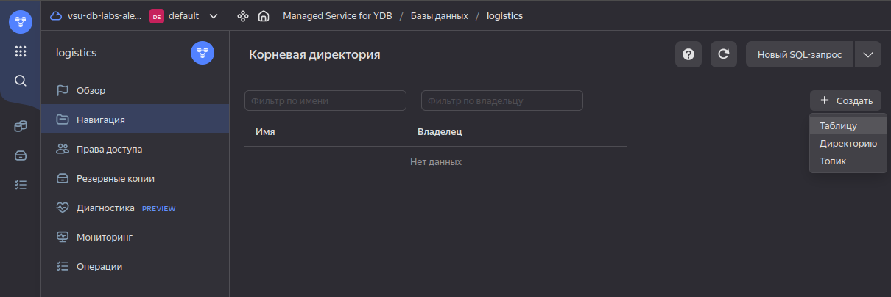

Далее, вы указываете имя таблицы и её колонки с названиями и типами. Изначально
у таблицы будет указано одна колонка `PK` под названием "id":

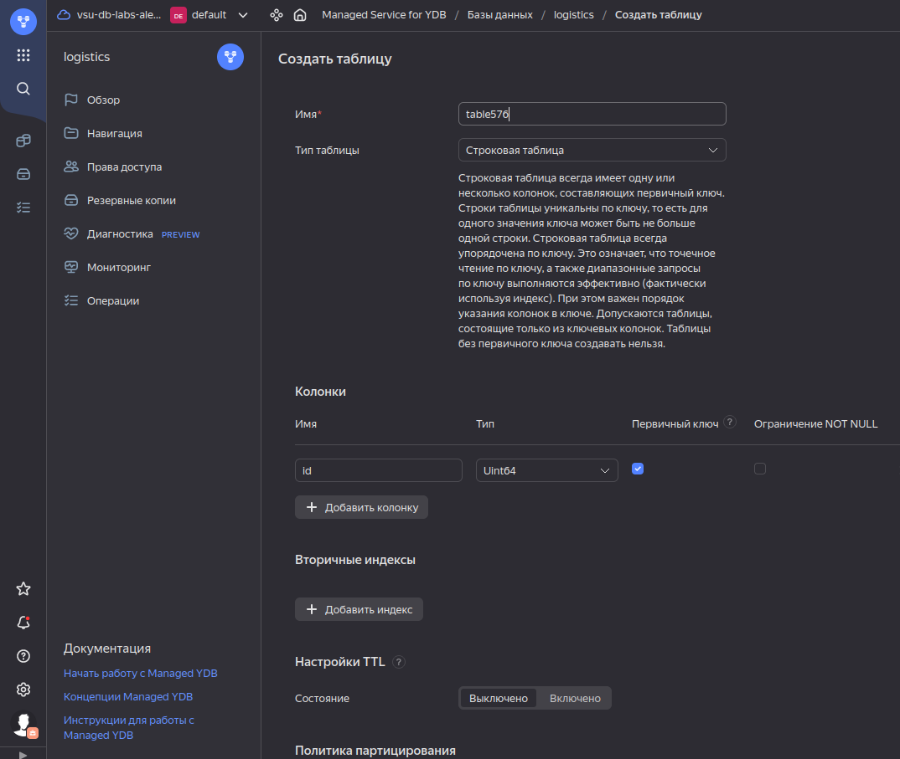

После создания можно перейти в таблицу и добавить немного данных через кнопку 
`Добавить строку`.  
Если чувствуете себя уверенно, то по кнопке `Новый SQL-запрос`, можете открыть
окно с выполняемыми запросами и либо вставить новые данные, либо попрактиковаться
в выборке данных:

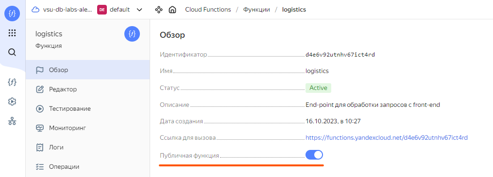

## Работа с Функциями

Для создания функции перейдите в раздел `Cloud Functions`:

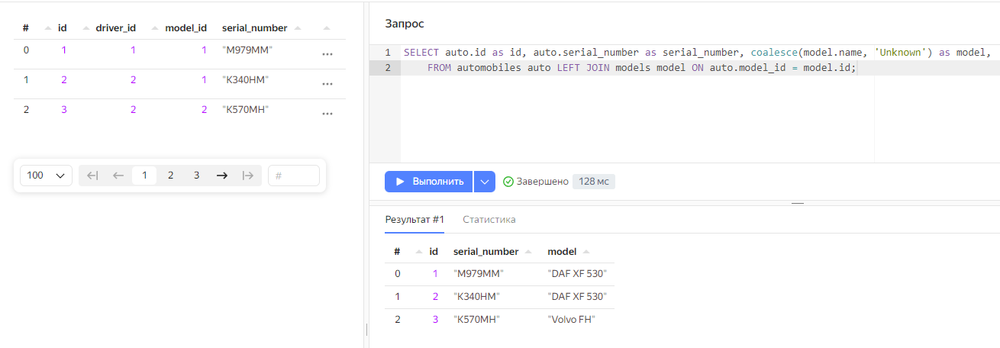

Укажите любое имя и описание:

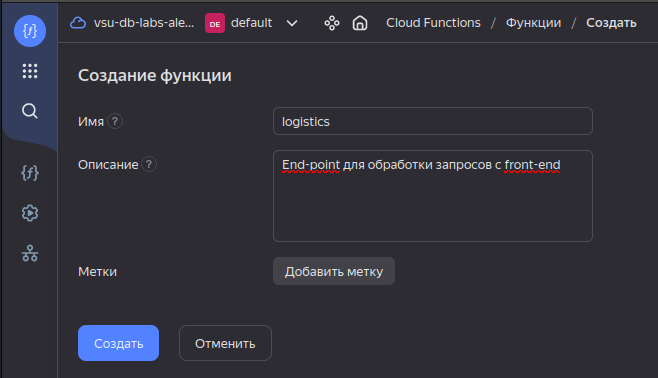

Далее, необходимо выбрать среду выполнения. Я советую Python, 
потому что для него имеются наработки, которые смогут вам помочь.
Если вы уверены, то можете попробовать среду, которая кажется вам интересной/полезной для изучения.

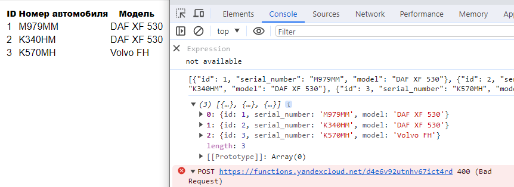

После создания, откроется редактор - страница, на которой вы пишете
непосредственно код, создаёте файлы и прочее. Изначально, точкой
входа в ваше приложение является функция `handler(event, context)` в файле
`index.py`, которой будет передаваться запрос с фронта.

Ваша функция должна будет обработать поля события и выполнить какой-либо
запрос. В качестве результата функция должна вернуть объект `JSON` со
[статусом](https://http.dev/status) и телом ответа.

Для отладки можете написать перед `return`:

```python
print(event)
print(context)
```

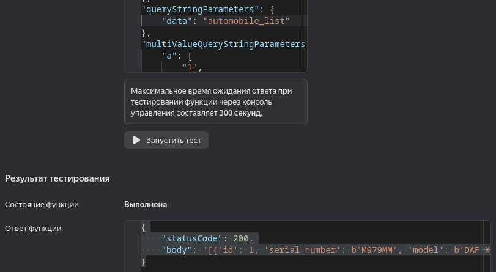

После написания обработчика его нужно сохранить, пролистнув страницу ниже
и нажав кнопку `Сохранить изменения`. Код будет проинтерпретирован, ошибки
выведутся как при компиляции.

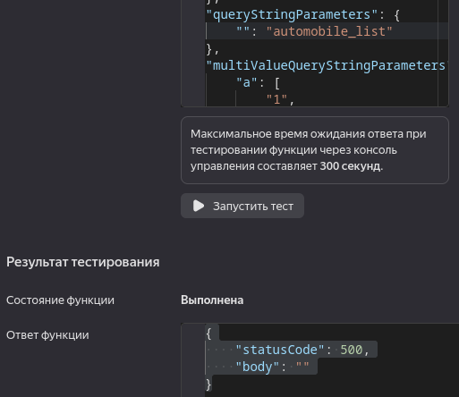

После обновления функции, можете перейти в раздел `Тестирование`. В поле
шаблон данных выбрать `HTTPS-вызов`. В поле ниже сгенерируется объект `JSON`,
что будет передан в качестве аргумента `event`. Внутри указывается
большое количество полей, *не пугайтесь: нам нужны будут лишь несколько*.

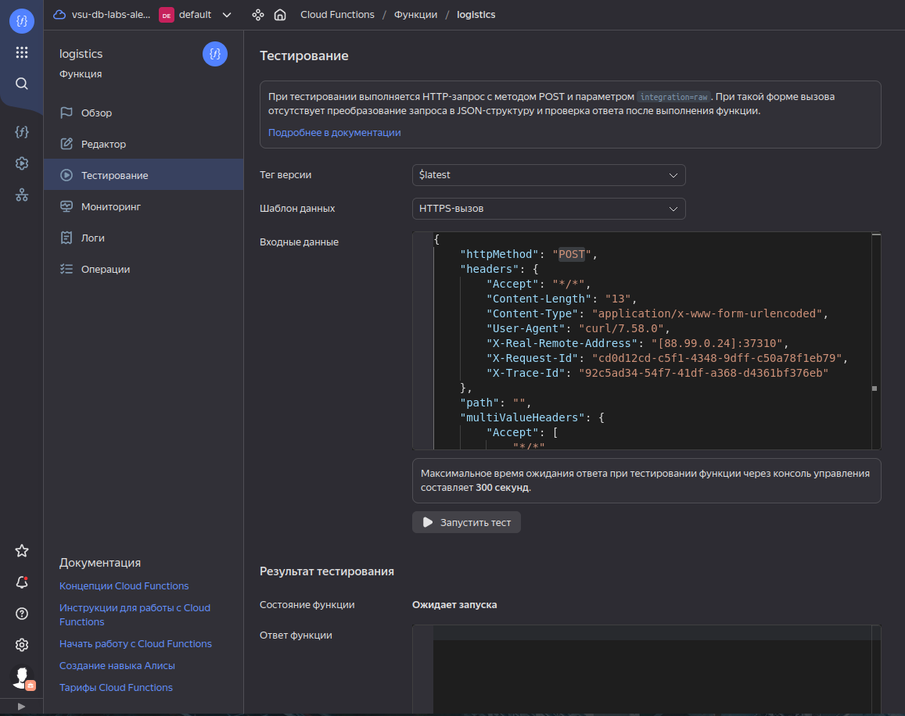

При нажатии кнопки `Запустить тест` в окне ответа будет выведен объект, что вернула
ваша функция. В разделе ниже, `Логах`, будет выведена дополнительная служебная 
информация и вывод метода `print()`:

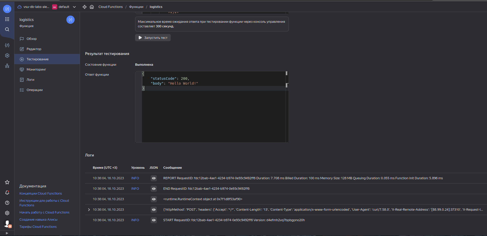

### Подключение БД к функциям

Для подключения к базе необходима служебная учётная запись. Аналог пользователей в PostgreSQL.
Она создается во вкладке `Сервисные аккаунты` на главной странице
платёжного аккунта:

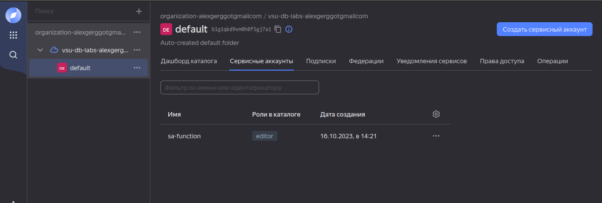

Для доступа аккаунту назначается роль `editor`. 
Остается лишь дописать саму функцию.

#### Набор зависимостей проекта - requirements.txt

Для обработки запросов вы можете использовать различные пакеты, список
которых необходимо записать в специальный файл `requirements.txt`:

```
iso8601==0.1.14
yandexcloud
ydb
protobuf==3.20.2
```

Как видно, здесь мы указываем зависимость от пакетов Яндекс облака и БД.

#### Набор используемых исключений - exception.py

Добавим файл с используемыми исключениями

```python
class CloudFunctionException(Exception):
    error = "Generic exception"
    def __init__(self, reason: str):
        self.reason = reason

class ConnectionFailure(CloudFunctionException):
    error = "Connection failure"

class ValidationError(CloudFunctionException):
    error = "Incoming parameters invalid"
```

#### Класс-хранилище переменных среды - config.py

Создадим объект, содержащий объекты окружения.
Это делается по соображениям безопасности: в переменных среды можно
хранить эндпоинты, важные адреса и пр. Плюс состоит в том, что они
будут только в вашей Функции - в сам репозиторий с кодом они не попадут,
никто не сможет воспользоваться эндпоинтом, чтобы без спроса лезть в
БД.

Методы, отмеченные `@property`, являются геттерами, к которым можно обращаться без
указывания скобок - как к публичному члену (`path = ydb_configuration.path`).

```python
import os

class Config(object):
    # конструктор, внутри которого мы запрашиваем переменные из Функции
    def __init__(self):
        self._endpoint = os.getenv("YDB_ENDPOINT")
        self._database = os.getenv("YDB_DATABASE")
        self._path = os.getenv("YDB_TABLE")

    @property
    def endpoint(self):
        return self._endpoint

    @property
    def database(self):
        return self._database

    @property
    def path(self):
        return self._path

    @property
    def full_path(self):
        return os.path.join(self.database, self._path)

ydb_configuration = Config()
```

Для задания этих переменных пролистните страницу редактора чуть ниже:

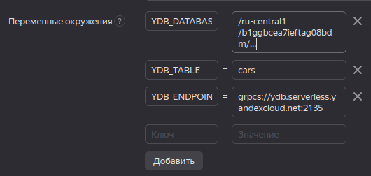

Ваш эндпоинт указан на странице БД:

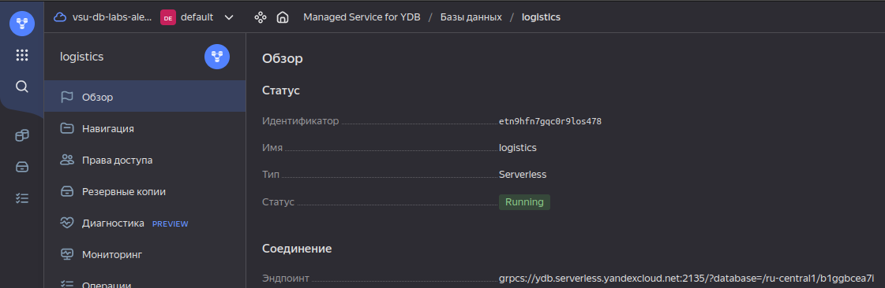

В переменную `YDB_ENDPOINT` занесите всё, что идёт **до** `/?database=`,   
например: `grpcs://ydb.serverless.yandexcloud.net:2135`.  
В переменную `YDB_DATABASE` занесите всё, что идёт **после** `/?database=`,   
например: `/ru-central1/r1gra875baommfd5leds/g5n22e7ejfr16h9oif9d`.

#### Класс для работы с подключением - dbclient.py

Добавим класс подключения к базе данных. Его задача - работать со средой для 
создания подключения к БД:

```python
import os
import ydb
import ydb.iam 

from typing import List
# Подключаем конфиг с переменными среды
from config import ydb_configuration
# Подключаем наше исключение
from exception import ConnectionFailure

class YDBClient:
    # Конструктор, создающий пустой драйвер
    def __init__(self) -> None:
        self.config = ydb_configuration
        self.driver = self.create_driver()

    # Создание драйвера по параметрам подключения
    def create_driver(self) -> ydb.Driver:
        # Задание адреса подключения из переменных среды
        # и передача данных служебного пользователя
        driver_config = ydb.DriverConfig(
            self.config.endpoint,
            self.config.database,
            credentials=ydb.iam.MetadataUrlCredentials(),
            root_certificates=ydb.load_ydb_root_certificate(),
        )
        self.driver = ydb.Driver(driver_config)
        try:
            self.driver.wait(fail_fast=True, timeout=5)
        except Exception:
            raise ConnectionFailure(self.driver.discovery_debug_details())
        return self.driver

    @property
    def table_client(self) -> ydb.TableClient:
        return self.driver.table_client

    def bulk_upsert(self, rows: List, column_types: ydb.BulkUpsertColumns):
        self.table_client.bulk_upsert(self.config.full_path, rows, column_types)

ydb_client = YDBClient()
```

Создаём объект с пустым драйвером, для подключение к самой базе используется метод `create_driver()`.

#### Класс для работы с БД - cars_reader.py

Для работы с конкретной базой создадим свой класс. Его задача - скрывать конкретные
запросы к базе, предоставляя интерфейс для получения от неё полезных данных. 

```python
import ydb

def blocking_query(session, query):
  return session.transaction().execute(
    query,
    commit_tx = True,
    settings = ydb.BaseRequestSettings().with_timeout(3).with_operation_timeout(2)
  )

class Cars_reader:

    def select_all_cars(self, session):
      query = '''SELECT * FROM cars;''';
      return blocking_query(session, query)
        
reader = Cars_reader()
```

Данный класс будет отличаться от базе к базе. Ваши новые запросы будут формироваться 
по следующему шаблону:

```python
def method_name(self, session):
    query = ''
    return blocking_query(session, query)
```

Это блокирующий запрос, скрипт для которого указывается в строке `query`. 
Параметр `self` передаётся всем методам класса, параметр `session` нужен для 
того, чтобы сигнатура(вид) функции соответствовала требованиям модуля для работы с БД. 
Он принимает в качестве параметра запроса не какую-либо структуру, а функцию.

#### Методы для перевода объектов в JSON - serialize.py

Чтобы отправить на фронт данные в корректном виде, создадим файл с
утилитами сериализации. Данный метод проходит все вхождения и записывает
кажду в виде строки к итоговому массиву `JSON`: 

```python
def to_json_array(rows) -> str:
  json = '['
  
  for entity in rows:
    json += str(entity) + ', '
  
  if(json != '['):
    json = json[:-2]
  json += ']'
  return json
```

#### Точка входа - index.py

Пришло время соединить запрос к функции с базой данных. В данной обработке
мы обращаемся к объекту `event` за методом. Если метод `GET`, то вернём в
результате все строки таблицы:

```python
import ydb
from dbclient import ydb_client
from serialize import to_json_array
from exception import ConnectionFailure
# Подключаем ваш класс для работы с БД
from cars_reader import reader

# Подключение по драйверу с настройками окружения
pool = ydb.SessionPool(ydb_client.create_driver())

# Для выполнения запроса, обращаемся к подключению
# за синхронным запросом и передаём в качестве параметра метод, который
# принимает объект сессии. Именно поэтому мы в классе по работе с БД
# передаём в методы параметр 'session'
def read_all_data():
  return pool.retry_operation_sync(reader.select_all_cars)

# Точка входа для обработки запроса с front-end
def handler(event, context):
  parameters = event['queryStringParameters']
  # Статус - неправильный запрос
  status = 400
  result = None

  # Если входящий запрос - GET, вернуть все данные
  if(event['httpMethod'] == 'GET'):
    result = read_all_data()
    status = 200

  # Вернуть статус, массив JSON при удачном запросе
  return {
    'statusCode': status,
    'body': to_json_array(result[0].rows) if status == 200 else '',
  }
```

### Тестирование

После завершения работы необходимо собрать Функцию. В тестировании 
выбрать `Шаблон данных - HTTPS-вызов`. 

Попробуем выполнить стандартный запрос без изменений, получим результат 400:

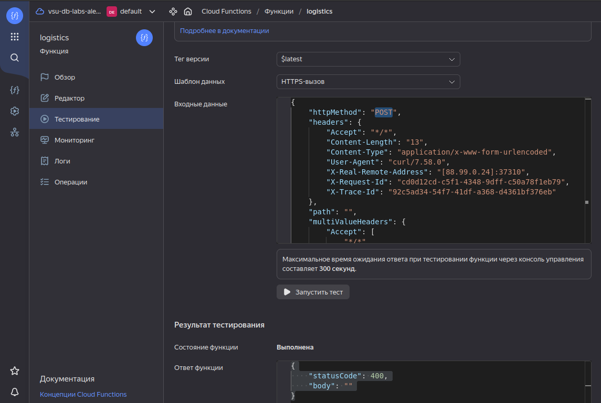

Поменяем поле `httpMethod` в исходном объекте на `GET`, по итогу получим код 200 и 
данные из таблицы:

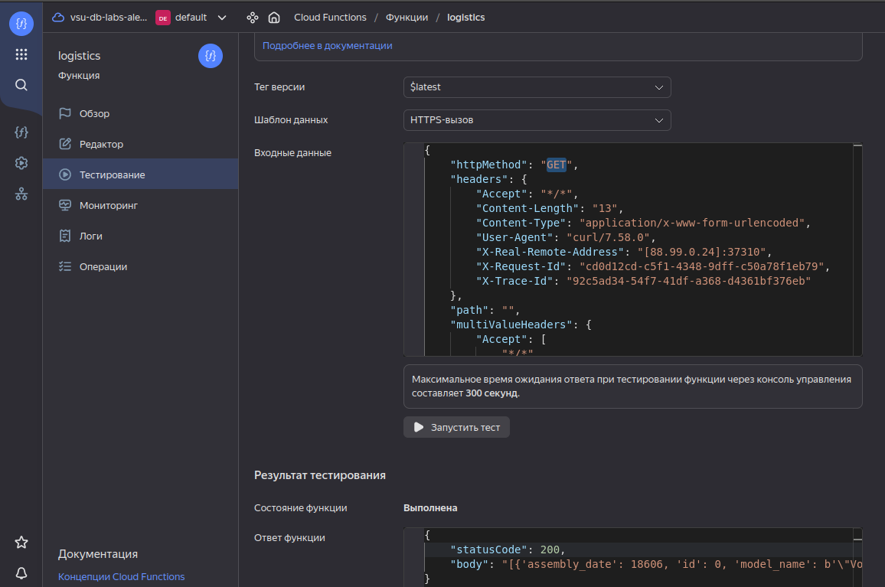

Обратите внимаение, что мы можем обратиться к любому полю входного объекта. В 
[примере](#точка-входа---indexpy) мы обращались к полю:

```python
event['httpMethod']
```

А также записали в неиспользуемую переменную параметры запроса, которые 
тоже можно редактировать в тестовой среде:

```python
parameters = event['queryStringParameters']
```