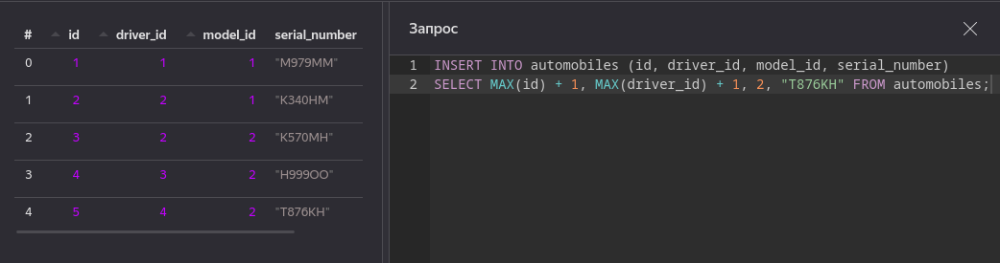
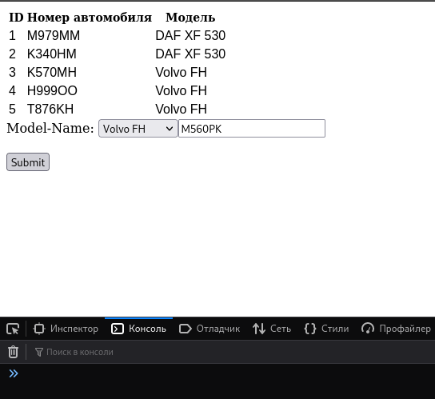
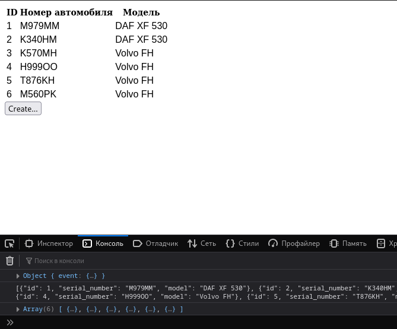

# Создание данных - Практическая работа по предмету "Управление данными"

## Работа с back-end

Для начала напишем и протестируем запрос для создания строки таблицы:



Приведенный запрос выбирает максимальный существующий
идентификатор и при помощи него формирует новый id.

Чтобы выполнять подобный запрос с данными от front-end, 
нужно дополнить класс для работы с сущностями:

```python
class Cars_reader:
    # В конструкторе создаем стандартное пустое значение
    def __init__(self):
      self.name = ''

    # Не убирайте все те запросы, что были здесь ранее! #

    # Метод, который передается сессии для выполнения запроса
    def insert_new_car(self, session):
      query = '''INSERT INTO automobiles (id, driver_id, model_id, serial_number)
        SELECT MAX(id) + 1, MAX(driver_id) + 1, 2, "{0}" FROM automobiles;'''.format(self.name)
      return blocking_query(session, query)

    # Сеттер, который задаст значение для создаваемого поля
    def set_name(self, name: str) -> None:
      self.name = name
```

Для того, чтобы вставлять данные в БД требуется обрабатывать с фронта
POST-запросы. Они отличаются по назначению и семантике от ранее
используемых GET-запросов. В код обработки запроса следует добавить:

```python
# Проверка данных, пришедших с фронта
def automobile_post_request(parameters):
  # Если среди параметров был серийный номер - создать запись
  # о новом автомобиле посредством метода, что был написан выше
  if 'number' in parameters:
    reader.set_name(parameters['number'])
    pool.retry_operation_sync(reader.insert_new_car)

# Если нам пришел GET-запрос, обработать его как и раньше
# Если пришел POST-запрос - вызвать новую функцию выше
def handler(event, context):
  if(event['httpMethod'] == 'GET'):
    return automobile_get_request(event['queryStringParameters'])
  elif(event['httpMethod'] == 'POST'):
    automobile_post_request(event['queryStringParameters'])
  # После выполнения POST-запроса вернуть тело event, чтобы 
  # можно было посмотреть не его содержимое в случае чего
  return {
    'statusCode': 200,
    'body': json.dumps(
        {
            'event': event
        }, 
        default=vars,
    ),
  }
```

## Работа с front-end

Порефакторим код, который был до этого, добавим на страницу форму для заполнения данных
```html
<html>
<head>
	<script type="text/javascript" src="car.js"></script>
	<script type="text/javascript" src="script.js"></script>
	<script type="text/javascript" src="https://code.jquery.com/jquery-3.7.1.min.js"></script>
	
	<script type="text/javascript">
		$(document).ready(function () {
			$("#car_table").hide();
			$('.error_message').hide();
			$("#car_create_form").hide();
            
			receive_update_car_list();
			update_model_selection();
			// Вот здесь выполненная вами инициализация имеющихся в БД данных -
            // ajax запрос с последующим заполнением таблицы на фронте. Код, который работал ранее
			
            // Спрятать форму создания, до тех пор, пока не нажата кнопка "Создать..."
			$("#car_create_form").hide();
			// Событие нажатия на кнопку "Создать..."
			$('#car_create_form_button').click(function () {
				$('#car_create_form_button').hide();
				$('#car_create_form').show();
			});

			// Событие подтверждения формы ввода
			$("#car_create_form").on("submit", function (event) {
				$('#car_create_form_button').show();
				$('#car_create_form').hide();
                // Вызов метода, о котором пойдет речь ниже
				create_new_car(
					$('#car_model_select option:selected').text(),
					$('#car_number_input').val());
				// Таким образом мы не перезагружаем страницу при нажатии на submit
				event.preventDefault();
			});
		});
	</script>
	<link rel="stylesheet" href="styles.css">

</head>
<body>

	<!-- Вот здесь все то, что у вас уже было сделано-->

	<!-- Кнопка, которая показывает форму -->
	<button type="button" , id="car_create_form_button">Create...</button>
	<!-- Форма добавления сущности, изначально скрыта -->
	<form id="car_create_form">
		<label for="model">Model-Name:</label>

		<select name="model" id="car_model_select" />
		<input type="text" id="car_number_input"><br><br>
		<input type="submit" value="Submit">
	</form>

</body>
</html>
```

У себя я вынес инициализацию таблицы в отдельный скриптовый файл.
Помимо этого добавил в него метод `create_new_car`:

```js
var ydb_url = 'https://functions.yandexcloud.net/...'

function preconvert_json(string) {
    let json = string.split('\'').join("\"");
    return json.split('b\"').join("\"");
}

/**
 * @brief Получить список автомобилей, предобработать JSON
 * и заполнить таблицу 'car_table'.
*/
function receive_update_car_list()
{
    $.ajax({
        url: ydb_url,
        method: 'GET',
        data: {
            "data": "automobile_list"
        },
        success: function(data){ 
            $("#car_table").show();
            $('#search_button').show();
            update_car_list(data)    
        }
    }).fail(function(data){
        output_error("GET request failed");
    })
}

/**
 * @brief Заполнение таблицы объектами Car из массива JSON
*/
function update_car_list(data) 
{
    $("#car_table td").parent().remove();
    let received_cars = JSON.parse(preconvert_json(data));
    if(received_cars.length > 0)
    {
        for(let i = 0; i < received_cars.length; ++i) {
            let car = new Car(received_cars[i]);
            $('#car_table tr:last').after(car.to_table_entry());
        }
        $("#car_table").show();
    } else {
        $('.error_message').show();
    }
}

/** 
 * @brief Метод для добавления строки в таблицу.
 * Выполняется асинхронный запрос, который по результатам
 * обновляет страницу, подтягивая созданные данные.
 */
function create_new_car(model, number)
{
    $.ajax({
        // Передача параметров в POST-запрос
        url: ydb_url + '?number=' + number,
        crossDomain: true,
        method: 'post',
        // Входные данные ожидаются в формате JSON
        dataType: "json",
      }).done(function(response) {
            // Вывод ответа и обновление таблицы с данными
            // Метод для обновления можно использовать тот же, что
            // и вызывается после загрузки страницы
            console.log(response);
            receive_update_car_list()
      });
}

function update_model_selection()
{
    $.ajax({
        url: ydb_url,
        method: 'GET',
        data: {
            "data": "model_list"
        },
        success: function (data) {
            console.log(preconvert_json(data))
            let namearray = JSON.parse(preconvert_json(data));
            console.log(namearray)
            for (let i = 0; i < namearray.length; ++i) {
                $('#car_model_select').append($('<option>', {
                    value: namearray[i].name,
                    text: namearray[i].name
                }));
            }
        }
    }).fail(function (data) {
        output_error("GET models request failed");
    })
}
```

После загрузки данных при нажатии на кнопку создания появится форма:



Если после заполнения данных нажать кнопку "Submit", мы отправим запрос, который
вызовет скрипт для вставки строчки в таблицу, сама таблица обновится:



## Задание

Реализовать вставку данных в вашу таблицу