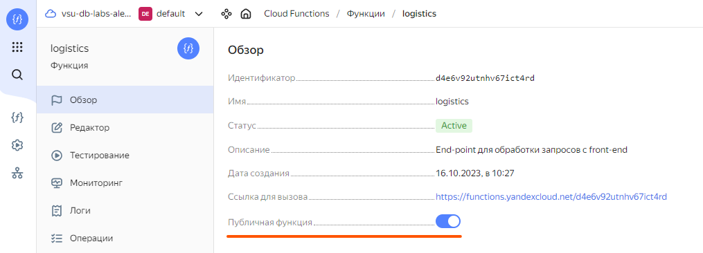
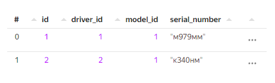
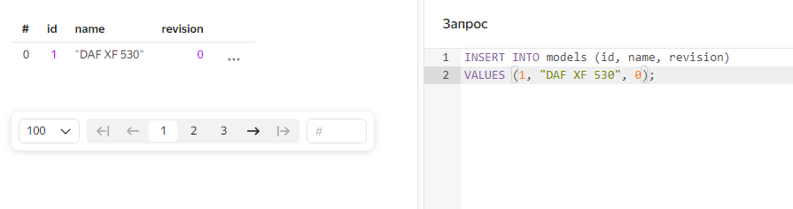
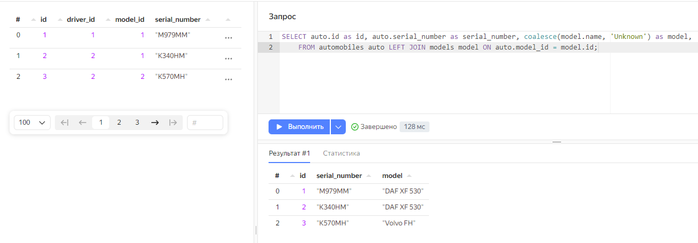
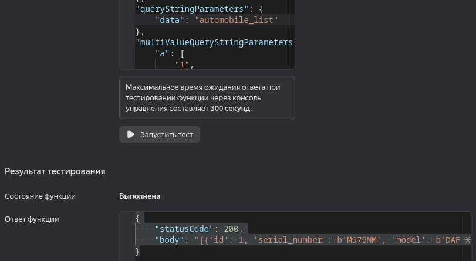
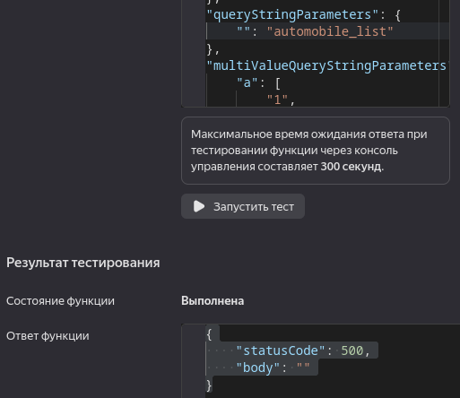
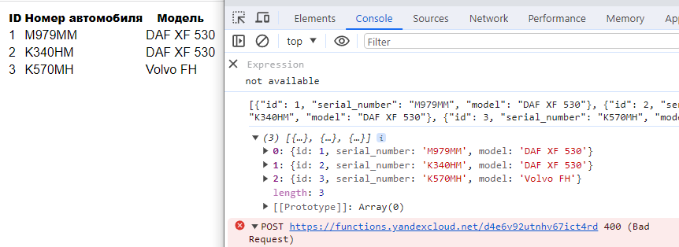

# Frontend - Практическая работа по предмету "Управление данными"

## Содержание

[Backend](#backend)  
[Frontend](#frontend)  
[Эксперименты](#э-э-эксперименты)  
[Задание](#задание)

## Backend

Для начала работы нужно сделать функцию публичной:


Это позволит нам обращаться к ней из веб-приложения без настройки 
токенов или ещё какой аутентификации. `Ссылка для вызова` потребуется нам позже.

Для примера была создана таблица, ссылающаяся полями `driver_id`, `model_id` на другие таблицы. 

  

В другую таблицу помещены данные, которые не до конца соответствуют тем, что в таблице `automobiles`.
Строковые значения задаются латиницей, чтобы не провоцировать конвертации во всякие utf8.  

  

Сделаем `SELECT`-запрос, получающий список номеров и моделей в читаемом виде. Обернём в `coalesce` конвертацию `null`-значений в строку, выполним его:

 

Получили строки, которые будут отправлены на front-end в удобном для него (как `view`) формате. Задача front-end заключается в том, чтобы просто отображать пользователю данные в иногда понятном, иногда красивом виде. Логика комбинаций и поиска значений из таблиц - задача нашей серверной функции. 

Она будет выполнять SQL-запросы, предоставляющие фронту строки отображаемых значений при помощи группировок, сортировок, соединений и прочего.

Соответственно, переносим запрос в публичный метод класса для работы с сущностями

```python
import ydb

def blocking_query(session, query):
  return session.transaction().execute(
    query,
    commit_tx = True,
    settings = ydb.BaseRequestSettings().with_timeout(3).with_operation_timeout(2)
  )

class Cars_reader:
    def serial_numbers_with_models(self, session):
      query = '''SELECT auto.id as id, auto.serial_number as serial_number, coalesce(model.name, 'Unknown') as model, 
    FROM automobiles auto LEFT JOIN models model ON auto.model_id = model.id;'''
      return blocking_query(session, query)
        
reader = Cars_reader()
```

Изменённая точка входа (`index.py`) тогда будет иметь вид:

```python
import ydb

from cars_reader import reader
from dbclient import ydb_client
from serialize import to_json_array
from exception import ConnectionFailure

import json

pool = ydb.SessionPool(ydb_client.create_driver())

def bad_request(code: int = 400, body = None):
  return { 
    'statusCode': code,
    'body': body
  }

def usual_responce(result):
  return { 
    'statusCode': 200,
    'body': to_json_array(result[0].rows)
  }

def automobile_get_request(parameters):
  if parameters['data'] == 'automobile_list':
    return usual_responce(pool.retry_operation_sync(reader.serial_numbers_with_models))
  else:
    return bad_request('Incorrect query parameters')

def handler(event, context):
  try:
    if(event['httpMethod'] == 'GET'):
      return automobile_get_request(event['queryStringParameters'])
    else:
      return bad_request()
  except:
    return {
      'statusCode': 500,
      'body': '',
    }
  return {
    'statusCode': 200
  }
```

После рефактора `handler` проверяет метод запроса, а затем передает управление функции,
что уже работает с параметрами. Если метод не `GET`, то функция вернет ответ "плохой запрос" (400).
Если сработает исключение - "внутренняя ошибка сервера" (500).

На момент отладки лучше убрать блок `try-catch`, чтобы видеть в ответе стек вызовов и место ошибки.

В разделе `Тестирование` в шаблоне `HTTPS-вызов` нужно заменить два поля как показано ниже:

```json
{
    "httpMethod": "GET",
    "queryStringParameters": {
        "data": "automobile_list"
    }
}
```

Не стирайте весь запрос, только замените соответствующие поля. Тогда получим:  
  

...или если что-то где-то упустили:  


## Frontend

Для создания приложения будем использовать [jQuery](https://jquery.com/). Когда-то популярный фреймворк
для Javascript. Сейчас с его помощью разве что можно довольно быстро протестировать 
какое-либо API.  

**По мере чтения, адаптируйте код под свой backend**

Создадим пустую страницу

```html
<html>
<head>
    <!-- Подключаемые из локального каталога файлы с описаниями классов и пр. -->
	<script type="text/javascript" src="car.js"></script>
	<script type="text/javascript" src="script.js"></script>
    <!-- Подключение jquery по общедоступной ссылке, можете перейти - посмотреть на 
    сжатый донельзя код фреймворка -->
	<script type="text/javascript" src="https://code.jquery.com/jquery-3.7.1.min.js"></script>
    <script type="text/javascript">
		// Скрипт, выполняемый при загрузке страницы
        // Он прячет элементы, которые будут отображать данные из базы
        $(document).ready(function() {
			$('#search_button').hide();
            $("#car_table").hide();
			$('.error_message').hide();
		});
	</script>
    <!-- Подключение стилей из внешнего файла -->
	<link rel="stylesheet" href="styles.css">
</head>

<body>
    <!-- Блок с текстом ошибки -->
	<div class='error_message'>Not found</div> 
    <!-- Таблица с идентификатором, при помощи которого к ней будет
    обращаться код, использующий jQuery -->
	<table id='car_table'>
		<tr>
			<th>ID</th>
			<th>Номер автомобиля</th>
			<th>Модель</th>
		</tr>
	</table>

    <!-- Скрипт, в котором можно будет настроить реакцию на какое-либо 
    событие элемента страницы: нажатие кнопки, изменение текстового поля и пр. -->
	<script type="text/javascript">
	</script>

</body>
</html>
```

При запуске мы ничего не увидим, добавим асинхронных запросов к нашей функции.
Пропишем в файле `script.js`:

```js
var yandex_function_url = 'https://functions.yandexcloud.net/...'
```

Создаем глобальную переменную, в которой хранится ссылка на нашу функцию.
Теперь в основном файле допишем метод, который будет выполнять два запроса:

```js
$(document).ready(function() {
    $('#search_button').hide();
    $("#car_table").hide();
    $('.error_message').hide();

    $.ajax({
        url: yandex_function_url,
        method: 'GET',
        data: {
            "data": "automobile_list"
        },
        // Поле, указывающее, какую функцию выполнить на 
        // успешное получение ответа
        success: function(data){ 
            $("#car_table").show();
            $('#search_button').show();
            console.log(preconvert_json(data))
            console.log(JSON.parse(preconvert_json(data)))
            update_car_list(data)    
        }
    }).fail(function(data){
        output_error("GET request failed");
    })

    // По примеру из прошлой лабы делаем заведомо неудачный 
    // POST запрос, выводящий ошибку
    $.ajax({
        url: yandex_function_url,
        method: 'POST',
        success: function(data){ 
            console.log(data); 
        }
    }).fail(function(data){
        output_error("POST request failed");
    })
});
```

Можно заметить, что в данном примере проиходит обращение к методам, которых
ещё не существует. Для того, чтобы это исправить, дополняем `script.js`:

```js
// Метод для конвертации формата python в воспринимаемую js строку
function preconvert_json(string) {
    let json = string.split('\'').join("\"");
    return json.split('b\"').join("\"");
}

// Метод, который будет заполнять таблицу пришедшими данными
function update_car_list(data) 
{
    $("#car_table td").parent().remove();
    let received_cars = JSON.parse(preconvert_json(data));
    if(received_cars.length > 0)
    {
        for(let i = 0; i < received_cars.length; ++i) {
            // Создаем объект класса для каждой пришедшей сущности
            let car = new Car(received_cars[i]);
            // Выполняем поиск элемента по ID, выбираем из него последний
            // элемент с тегом tr - table row
            $('#car_table tr:last').after(car.to_table_entry());
        }
        $("#car_table").show();
    } else {
        output_error("Incorrect data received")
    }
}

// Метод, который покажет сообщение об ошибке и скроет её через пару секунд 
function output_error(message, timeout = 2000) 
{
    $('.error_message').show();
    $('.error_message').text(message);
    setTimeout(function() {
        $('.error_message').hide();
    }, timeout);
}
```

Теперь у нас есть скрипт, который создает объекты `Car` и вызывает у них метод `to_table_entry()`.
Реализуем и его в `car.js`

```js
// Конструктор, формирующий поля класс по объекту JSON
function Car(obj) {
    this.id = obj.id;
    this.model_name = obj.model;
    this.serial_number = obj.serial_number;
}

// Реализация класса 
Car.prototype = {
    constructor: Car,
    print: function(){
        console.log(this.to_string());
    },
    to_string: function() {
        return "Id: " + this.id + ", serial_number: " + this.serial_number + ", name: " + this.model_name;
    },
    // Используемый ранее метод, возвращающий форматированные поля класса
    // <tr>...</tr> - строка таблиы, table row
    // <td>...</td> - элемент на пересечении колонки и строки
    to_table_entry: function() {
        return '<tr><td>' + 
        this.id + '</td><td>' + 
        this.serial_number + '</td><td>' + 
        this.model_name + '</td></tr>'
    }
}
```

Таким образом, при создании объекта, у него формируется три поля, которые будут
отформатированы методом как HTML-таблица и встроены в содержимое страницы.

## Э-э-эксперименты!

При открытии страницы в браузере отобразится:

  

Итак, наше пока что не самое полезное приложение заработало. В консоли виден ответ
Функции в виде форматированной строки, а также вывод уже конвертированного `JSON`
объекта. 

## Задание

1. Отобразите на странице результат запроса к своей собственной таблице.
Заполните какими-либо данными пару таблиц, выполните `SELECT` запрос с каким-либо
соединением.

2. Добавьте на страницу выпадающий список...

```html
<select id="categories">
    <option value="blank" selected>...</option>
</select>
```

...в который должен будет прийти результат группировки для отображаемой таблице.
При выборе какого-либо из пунктов выполняется фильтр по этому значению. Шаблоны кода
дополните и поместите в какой-нибудь скрипт

```js
// Задание списку события при изменении значения 
$('#categories').change(function(){ 
    $('select option:selected')
    ... 
})

// Очистка списка
$('#categories')
  .find('option')
  .remove()
  .end()
  .append('<option value="whatever">...</option>')
  .val('blank');

// Добавление в конец
$('#categories').append($('<option>', {
   value: ...,
   text: ...
}));

```

**ВНИМАНИЕ**: на фронте не должно быть никакой логики обработки 
сущностей: группировки и фильтры выполняются средствами SQL.